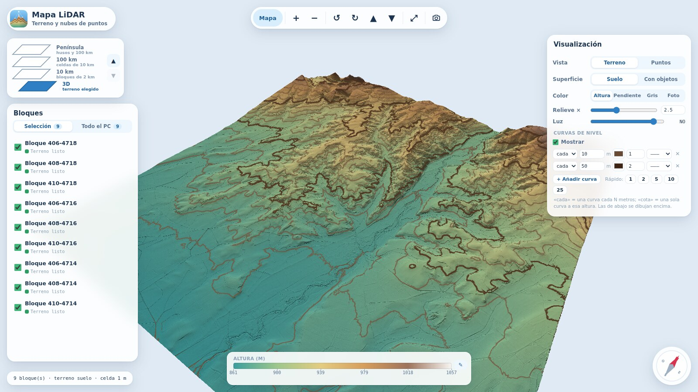

# Mapa LiDAR

**Castellano** · [English](README.en.md)

Visor local de terreno LiDAR para España. Eliges bloques de 2×2 km sobre un mapa, la app descarga y procesa
los datos PNOA-LiDAR que haya disponibles y los muestra en 3D como relieve sombreado, con curvas de nivel,
escala de color editable u ortofoto encima. Todo corre en tu ordenador: no hay servidor externo ni cuenta.



*Terreno a 1 m de 6×6 km (9 bloques PNOA) con color por altura, relieve ×2,5 y curvas cada 10 m. Datos: PNOA-LiDAR 2021 © IGN / Junta de Castilla y León (CC BY 4.0).*

> Estado: **v0.3, experimental.** Se ha usado sobre todo en Windows. Algunas partes (ortofoto con el WMS real
> del IGN, descarga de geoEuskadi) se han probado poco; ver [Limitaciones](#limitaciones).

## Funciones

- **Mapa de selección** (OpenStreetMap) con cuadrícula UTM jerárquica: península → celdas de 100 km →
  10 km → bloques de 2 km. Cada bloque indica su estado: listo, parcial, descargado sin procesar,
  disponible para descargar, sin enlace directo o sin datos.
- **Búsqueda de localidades** (Nominatim), selección por rectángulo con tabla de bloques y bloques de celdas
  vecinas.
- **Descarga y procesado automáticos** donde hay enlace directo público (Castilla y León, geoEuskadi). Para el
  resto, ayuda paso a paso con el Centro de Descargas del CNIG; los LAZ que dejes en *Descargas* se detectan.
- **Vista 3D del terreno**: MDT (suelo) o MDS (con edificios y vegetación), sombreado por píxel, color por
  altura, pendiente, gris u **ortofoto PNOA**, exageración vertical libre (y aparte para objetos), costuras
  entre bloques sin saltos.
- **Curvas de nivel** configurables (equidistancia o cota concreta, color, grosor, patrón).
- Brújula, barra de escala de color editable (doble clic) y **modo foto** (oculta la interfaz y exporta PNG).
- Vista de **nube de puntos** COPC con carga bajo demanda y filtro por clases.

## Requisitos

- [Node.js](https://nodejs.org/) 20 o superior.
- Python 3.10+ con `numpy` y `laspy[lazrs]` para procesar el terreno. La app detecta Python y ofrece un botón
  para instalar los paquetes; también puedes hacerlo a mano:
  ```
  pip install numpy "laspy[lazrs]"
  ```
- Opcional, para convertir a nube COPC: `pip install -r tools/requirements.txt` (añade `copclib`).
- Espacio en disco: cada bloque PNOA de 2×2 km ocupa del orden de cientos de MB en LAZ.

## Instalación y uso

```
git clone <url-del-repositorio>
cd mapa-lidar
npm install
npm run dev          # abre http://localhost:4180
```

En Windows puedes usar los lanzadores: `launcher\CrearAccesoDirecto.bat` crea un icono en el escritorio,
`launcher\MapaLidar.bat` arranca (e instala dependencias la primera vez) y `launcher\Detener.bat` para el
servidor.

Flujo básico:

1. Busca un lugar o navega por el mapa hasta los bloques de 2 km.
2. Selecciona bloques (clic o rectángulo) y pulsa **Descargar**. La app descarga y genera el terreno.
3. Pulsa el nivel **3D** para verlos en relieve.

Procesado manual (por ejemplo, con LAZ del CNIG):

```
python tools/lidar2mdt.py data/entrada/<carpeta>/*.laz --salida data/zonas/<zona> --res 1
python tools/lidar2copc.py data/entrada/BLOQUE.laz data/zonas/<zona>/BLOQUE.copc.laz   # nube de puntos
```

`python tools/lidar2mdt.py -h` explica las opciones (`--res`, `--nombre`, `--extension`, `--huso`…).

### Variables de entorno

| Variable | Uso |
| --- | --- |
| `MAPA_LIDAR_DATOS` | Carpeta de zonas (por defecto `data/zonas`) |
| `MAPA_LIDAR_PYTHON` | Ruta del Python que se usará para procesar |
| `MAPA_LIDAR_WMS_ORTO` | WMS alternativo para la ortofoto |

## Cómo funciona

```
Catálogos oficiales ──descarga LAZ──▶ data/entrada ──tools/lidar2mdt.py──▶ data/zonas/<zona>/*.mdt.bin, *.mds.bin
                                                   └─tools/lidar2copc.py─▶ data/zonas/<zona>/*.copc.laz
data/zonas ──server/ (middleware de Vite: /api/…, peticiones Range)──▶ navegador (three.js + shaders GLSL)
```

- `server/`: catálogo de bloques, cola de descargas y procesado, proxy de búsqueda y de ortofoto (con caché).
- `src/`: interfaz (mapa, paneles) y visor 3D (`src/viewer`).
- `tools/`: conversores en Python (rejilla MDT/MDS con relleno de huecos; COPC).
- Las rejillas son Float32 little-endian, fila 0 = sur; los metadatos van en `*.terreno.json`.

Pruebas: `npm test`.

## Datos y atribución

La app **no incluye datos**: todo se descarga al usarla y se guarda en `data/` (que Git ignora). Los datos
tienen sus propias licencias y condiciones; revísalas antes de redistribuir nada que generes con ellos.

| Fuente | Uso en la app |
| --- | --- |
| PNOA-LiDAR, © Instituto Geográfico Nacional (IGN) / CNIG | Nubes de puntos LiDAR |
| [Lidar PNOA2 Castilla y León](https://open.scayle.es/dataset/lidar-pnoa) (Junta de Castilla y León) | Descarga directa de bloques |
| [geoEuskadi](https://www.geo.euskadi.eus/) (Gobierno Vasco) | Descarga directa de teselas (licencia sin confirmar) |
| [Centro de Descargas del CNIG](https://centrodedescargas.cnig.es/) | Resto de España (descarga manual) |
| Ortofoto PNOA, WMS del IGN (`www.ign.es/wms-inspire/pnoa-ma`) | Textura «Foto»; CC BY 4.0, scne.es |
| © [colaboradores de OpenStreetMap](https://www.openstreetmap.org/copyright) | Mapa base (ODbL) y búsqueda (Nominatim) |

Uso de servicios públicos: el mapa base usa los servidores de teselas de OpenStreetMap y la búsqueda usa
Nominatim, ambos con políticas de uso justo (la app limita la búsqueda a 1 petición/s y guarda caché). Para un
uso intensivo o compartido, conviene usar tu propio servidor de teselas o de geocodificación.

## Limitaciones

- Solo hay descarga automática donde existe un enlace directo público. En Castilla y León, los bloques CE y NW
  de la lista oficial respondían 403 en la última prueba; el CNIG no ofrece API pública documentada.
- Ortofoto con el WMS real del IGN y descarga de geoEuskadi: poco probadas.
- Convertir a COPC un bloque de 25–40 M puntos puede necesitar 3–4 GB de RAM.
- Los lanzadores `.bat` son solo para Windows; en otros sistemas usa `npm run dev`.
- La interfaz está en castellano.

## Contribuir

Se aceptan *issues* y *pull requests*. Ejecuta `npm test` antes de enviar cambios.

## Licencia

Código bajo licencia [MIT](LICENSE). Las dependencias conservan sus licencias (three.js, copc.js y Vite: MIT;
laz-perf: Apache-2.0). Los datos descargados siguen las licencias de sus proveedores.
