# Mapa LiDAR

**Castellano** · [English](README.en.md)

Visor local de terreno LiDAR para España. Eliges bloques de 2×2 km sobre un mapa, la app descarga y procesa
los datos PNOA-LiDAR que haya disponibles y los muestra en 3D como relieve sombreado, con curvas de nivel,
escala de color editable u ortofoto encima. Incluye herramientas para medir puntos del terreno y para estudiar por
dónde llevaría el agua un canal por gravedad (acueductos). Todo corre en tu ordenador: no hay servidor externo ni cuenta.


*Terreno a 1 m de 6×6 km (9 bloques PNOA) con color por altura, relieve ×2,5 y curvas cada 10 m. Datos: PNOA-LiDAR 2021 © IGN / Junta de Castilla y León (CC BY 4.0).*

> Estado: **v0.4, experimental.** Se ha usado sobre todo en Windows. Algunas partes (la descarga
> automática de geoEuskadi) se han probado poco; ver [Limitaciones](#limitaciones).

> **¿Quieres usarlo en tu país o región?** Ver [Adáptalo a tu región](#adáptalo-a-tu-región).

## Qué puede hacer

### 1. Mapa de selección

La app abre en un mapa de OpenStreetMap con la cuadrícula UTM oficial de los bloques LiDAR. Se baja por niveles,
como capas: **Península** (husos y cuadrados de 100 km) → **100 km** (celdas de 10 km) → **10 km** (bloques de
2×2 km) → **3D** (terreno de los bloques elegidos). Las flechas del selector de niveles suben y bajan, y el zoom
entre niveles es animado.

| Península y celdas | Bloques de 2 km |
| --- | --- |
| 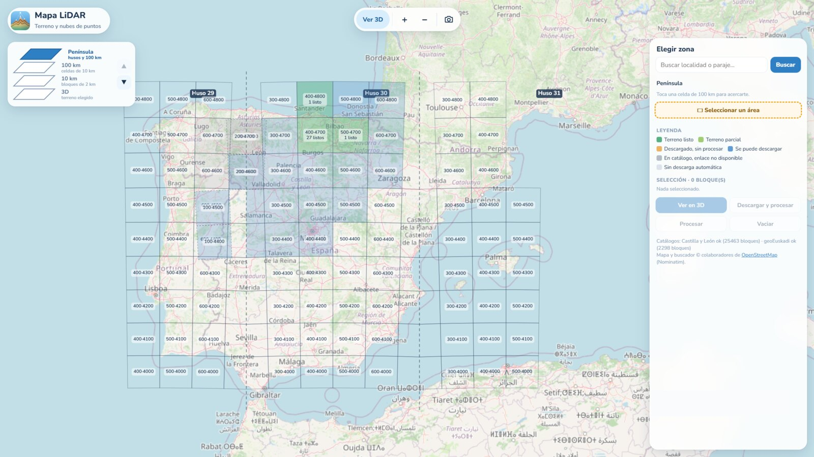 | 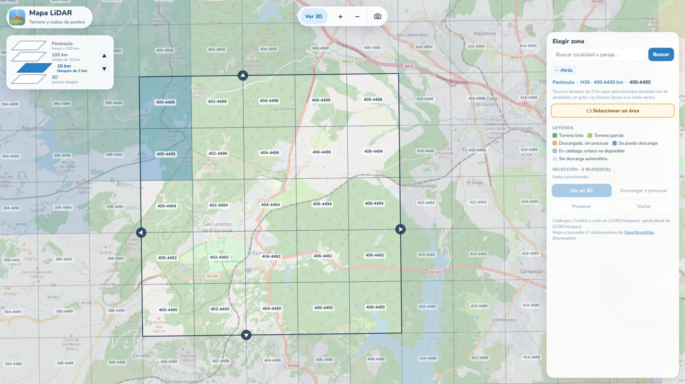 |

- **Estado de cada bloque** con colores: terreno listo, parcial, descargado sin procesar, se puede descargar,
  en catálogo pero sin enlace disponible, o sin descarga automática.
- **Búsqueda de localidades y parajes** (Nominatim): centra el mapa y marca el punto.
- **Celdas vecinas**: en el nivel de 10 km se ven también los bloques de alrededor (en gris) y se pueden elegir;
  unas flechas en los bordes saltan a la celda contigua.
- **Selección por área**: se dibuja un rectángulo y aparece una tabla con todos los bloques de dentro, su estado y
  qué hacer con cada uno (descargar, procesar, ver en 3D o cómo conseguirlo).
- **Descarga y procesado automáticos** donde hay enlace directo público (Castilla y León y geoEuskadi): la app
  descarga los LAZ, los convierte en terreno con Python y los deja listos. Hay una cola de trabajos con progreso.
- **Resto de España**: para cada bloque, una ayuda con el enlace al Centro de Descargas del CNIG, las coordenadas
  para buscarlo y los pasos. Los LAZ que dejes en tu carpeta *Descargas* se detectan y se pueden procesar.

| Selección por área | Ayuda para bloques sin descarga directa |
| --- | --- |
| 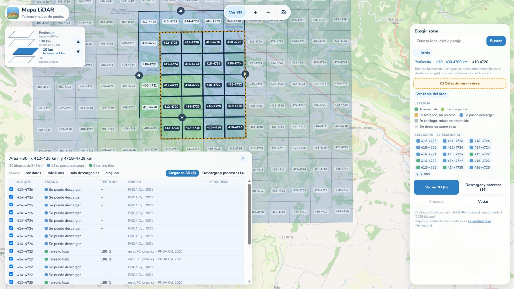 | 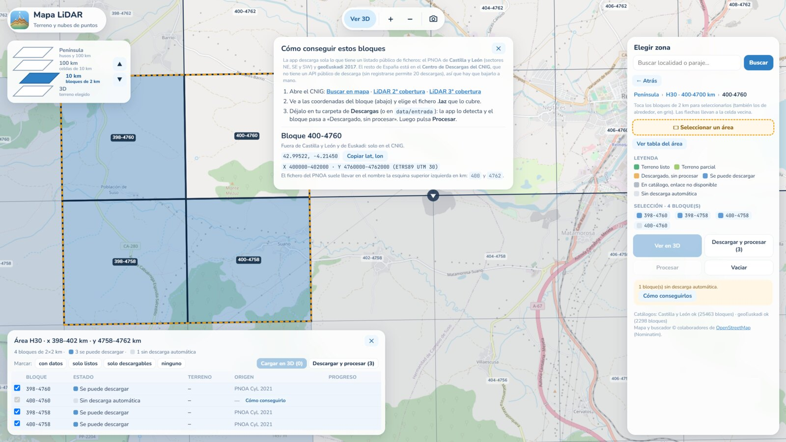 |

### 2. Vista 3D del terreno

- **Suelo (MDT) o Con objetos (MDS)**: terreno desnudo, o con edificios y árboles. En el MDS, los objetos tienen
  su propia exageración vertical («Objetos ×»), independiente de la del relieve.
- **Color**: por altura (con escala de colores editable), por pendiente, gris (solo sombreado) u **ortofoto PNOA**
  del IGN sobre el relieve.
- **Relieve ×**: exageración vertical libre (se puede escribir cualquier valor, p. ej. 32).
- **Luz**: dirección del sol para el sombreado.
- Varios bloques se unen **sin costuras**: los bordes se calculan con los datos del bloque vecino.
- **Barra de escala** abajo con las alturas reales; doble clic para cambiar colores y rango.
- **Brújula**: indica el norte; al pulsarla, la vista se orienta al norte.

| Ortofoto sobre el relieve | Con objetos (edificios y árboles) |
| --- | --- |
| 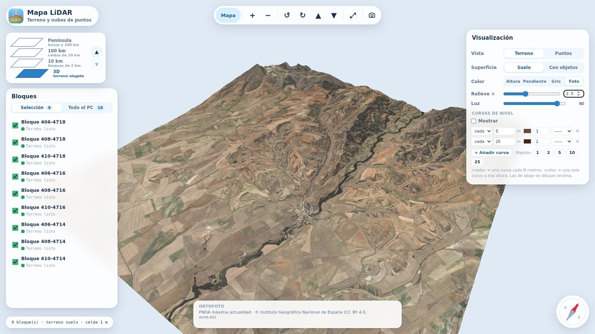 | 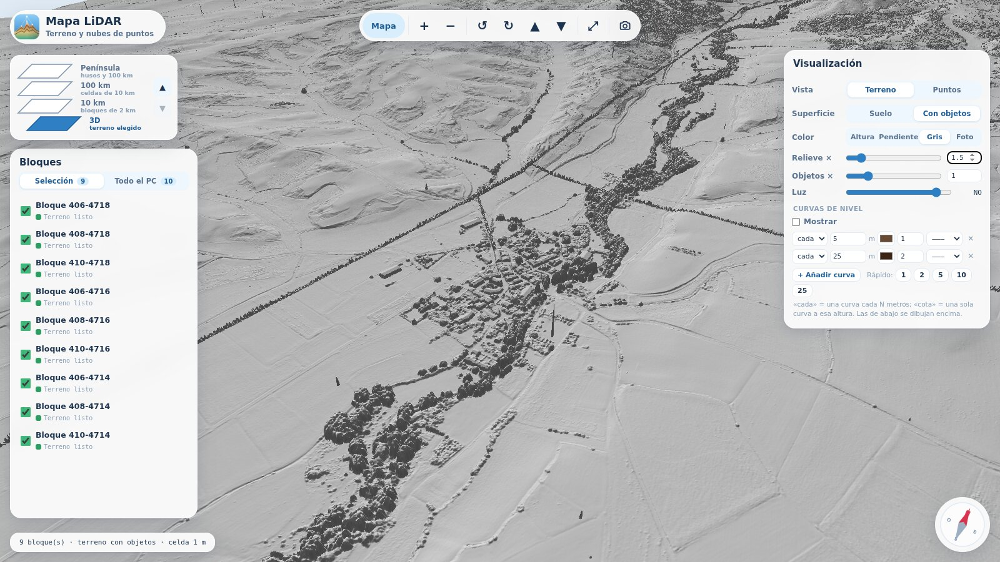 |

### 3. Curvas de nivel

Lista editable de curvas: **cada N metros** o **a una cota concreta**, cada una con su color, grosor y patrón
(continua, discontinua, puntos, raya-punto). Botones rápidos para 1, 2, 5, 10 y 25 m con curva maestra.

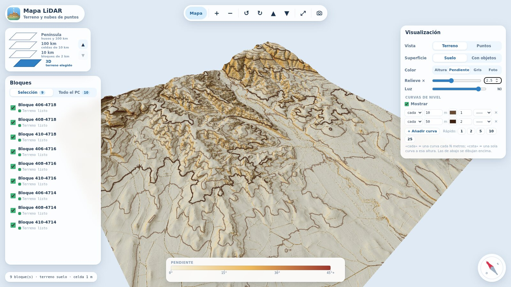

### 4. Nube de puntos

Vista de la nube LiDAR original (formato COPC), cargada por partes según la distancia. Color real (RGB),
por clase, por altura o por intensidad; filtro por clases (suelo, vegetación, edificios, agua…); calidad y
tamaño de punto ajustables.

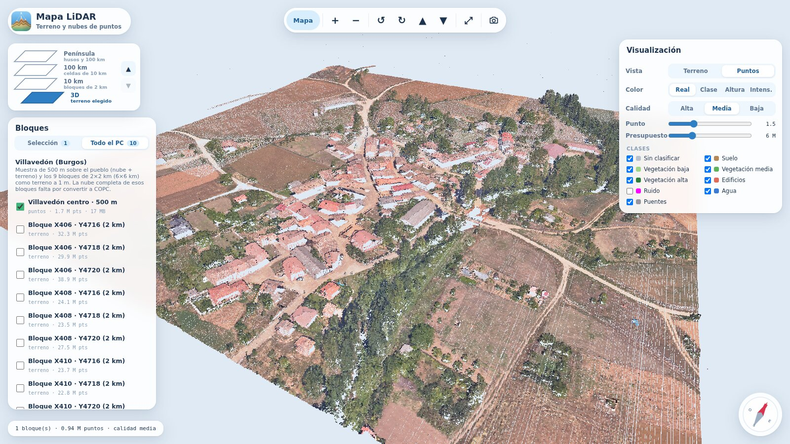

### 5. Inspeccionar un punto

Con la chincheta de la barra, cada clic en el terreno muestra las coordenadas (UTM y latitud/longitud, con botones
para copiarlas), la altura del suelo, la de los objetos si está activado «Con objetos» y la pendiente.

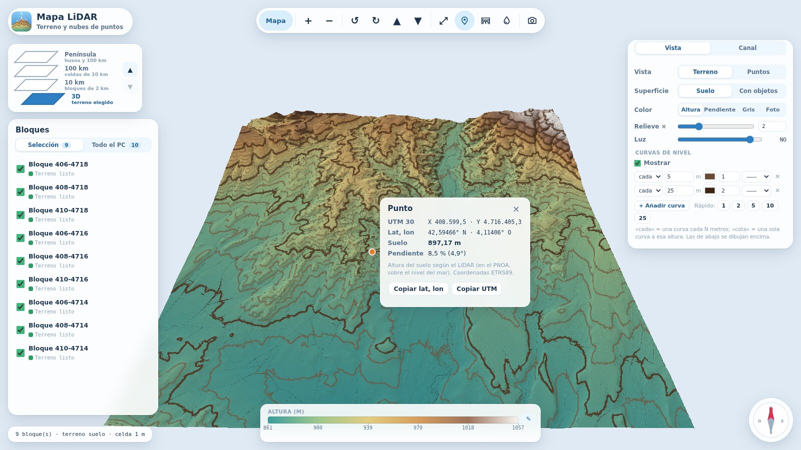

### 6. Canal por gravedad: acueductos

Herramienta pensada para estudiar por dónde podría llevarse el agua desde un manantial, como hacían los ingenieros
romanos. Todo se calcula sobre el MDT del LiDAR.

- **Solo manantial:** traza hacia los dos lados de la ladera el canal que baja siempre la misma pendiente y se ciñe
  al terreno, rodeando cada vaguada.
- **Manantial, puntos intermedios y destino:** el recorrido se hace **por tramos**. Cada tramo empieza a la cota a la
  que llegó el anterior y puede ser **canal** o **sifón**.
- **Rutas alternativas:** en los tramos de canal se buscan hasta tres trazados (menos obra, equilibrada, más directa)
  con una búsqueda de camino de menor coste, como un navegador de mapas, pero pagando por la obra en vez de por el
  tiempo. Se elige uno y el resto del recorrido se recalcula.
- **Obra marcada por colores:** azul por la ladera, rojo donde haría falta puente o terraplén, naranja donde haría
  falta zanja o túnel, morado los resaltos (caídas bruscas) y verde azulado los sifones.
- **Sugerencias de sifón:** si una ruta necesita un puente más alto de lo razonable (50 m por defecto), la app lo
  señala y, si aceptas, convierte ese tramo en sifón y recalcula lo que viene después. La decisión es tuya.
- **Datos de cada tramo:** longitud, desnivel, pendiente media, metros de obra y altura máxima; en los sifones,
  además, profundidad y presión aproximada.
- **Parámetros ajustables:** pendiente mínima y máxima, tolerancia, umbral de sifón y pérdida de carga del sifón.

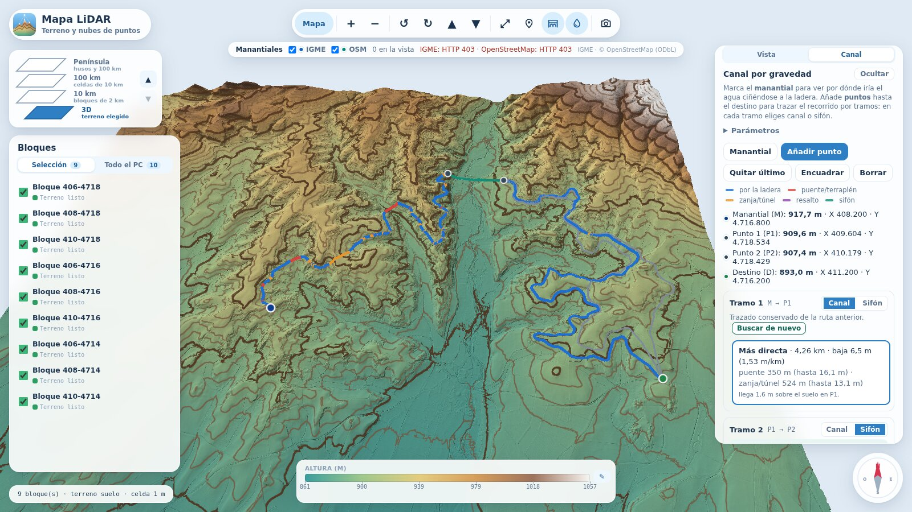

> Los valores por defecto (pendientes, umbral de puente, pérdida en el sifón) son puntos de partida razonables, no
> datos históricos: contrástalos con tus fuentes. El trazado es una **aproximación**: la cota del canal depende del
> camino recorrido, así que la búsqueda no garantiza el óptimo exacto.

### 7. Manantiales conocidos

Capa opcional con los manantiales inventariados, en el mapa (nivel de 10 km) y en 3D:

- **IGME**, Base de datos de Puntos de Agua: topónimo, cota, caudal de referencia y municipio.
- **OpenStreetMap**, puntos etiquetados como `natural=spring`.

Al tocar uno se ven sus datos, se compara la cota de la fuente con la del LiDAR y se puede usar directamente como
manantial del canal. Las consultas se guardan en caché en `data/manantiales`.

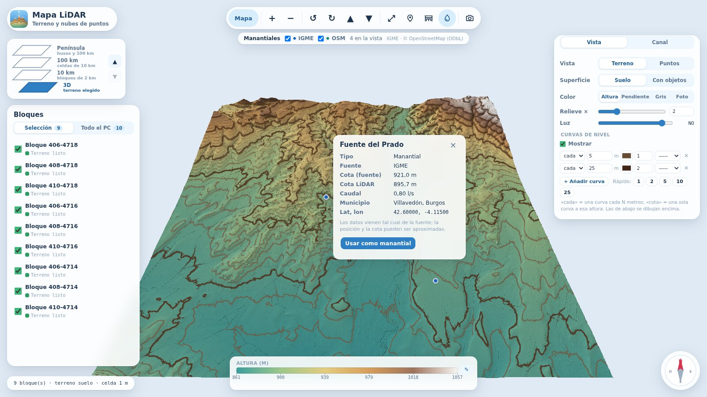


### 8. Modo foto

Oculta la interfaz (se elige qué se queda: brújula, escala, atribución…) para hacer capturas limpias, y
guarda la vista 3D como PNG. `Esc` para salir.

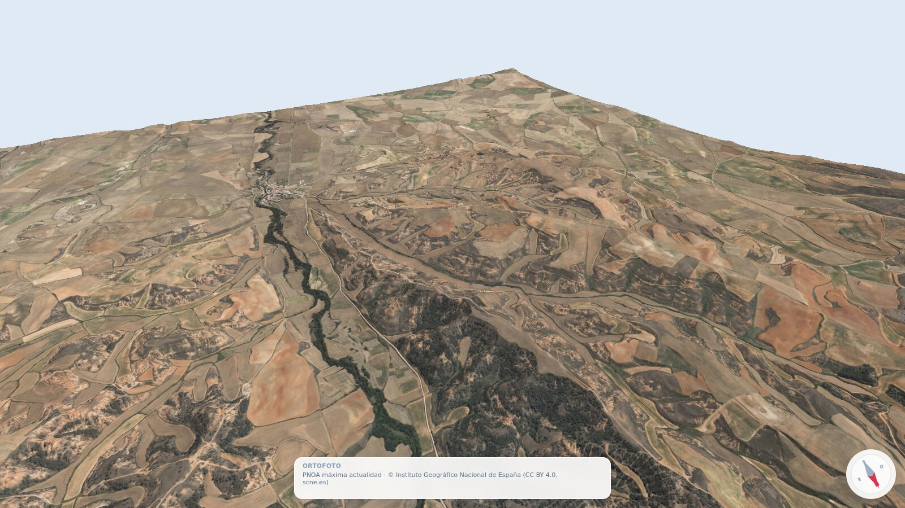

*Capturas de pantalla: terreno y ortofoto PNOA © IGN / Junta de Castilla y León (CC BY 4.0); mapa base ©
colaboradores de OpenStreetMap.*

## Requisitos

- [Node.js](https://nodejs.org/) 20 o superior.
- Python 3.10+ con `numpy` y `laspy[lazrs]` para procesar el terreno. La app detecta Python y ofrece un botón
  para instalar los paquetes; también puedes hacerlo a mano:
  ```
  pip install numpy "laspy[lazrs]"
  ```
- Opcional, para convertir a nube COPC: `pip install -r tools/requirements.txt` (añade `copclib`).
- Espacio en disco: cada bloque PNOA de 2×2 km ocupa del orden de cientos de MB en LAZ.

## Instalación y uso

```
git clone <url-del-repositorio>
cd mapa-lidar
npm install
npm run dev          # abre http://localhost:4180
```

En Windows puedes usar los lanzadores: `launcher\CrearAccesoDirecto.bat` crea un icono en el escritorio,
`launcher\MapaLidar.bat` arranca (e instala dependencias la primera vez) y `launcher\Detener.bat` para el
servidor.

Flujo básico:

1. Busca un lugar o navega por el mapa hasta los bloques de 2 km.
2. Selecciona bloques (clic o rectángulo) y pulsa **Descargar y procesar**. La app descarga y genera el terreno.
3. Pulsa el nivel **3D** para verlos en relieve.

Procesado manual (por ejemplo, con LAZ del CNIG):

```
python tools/lidar2mdt.py data/entrada/<carpeta>/*.laz --salida data/zonas/<zona> --res 1
python tools/lidar2copc.py data/entrada/BLOQUE.laz data/zonas/<zona>/BLOQUE.copc.laz   # nube de puntos
```

`python tools/lidar2mdt.py -h` explica las opciones (`--res`, `--nombre`, `--extension`, `--huso`…).

### Variables de entorno

| Variable | Uso |
| --- | --- |
| `MAPA_LIDAR_DATOS` | Carpeta de zonas (por defecto `data/zonas`) |
| `MAPA_LIDAR_PYTHON` | Ruta del Python que se usará para procesar |
| `MAPA_LIDAR_WMS_ORTO` | WMS alternativo para la ortofoto |

## Cómo funciona

```
Catálogos oficiales ──descarga LAZ──▶ data/entrada ──tools/lidar2mdt.py──▶ data/zonas/<zona>/*.mdt.bin, *.mds.bin
                                                   └─tools/lidar2copc.py─▶ data/zonas/<zona>/*.copc.laz
data/zonas ──server/ (middleware de Vite: /api/…, peticiones Range)──▶ navegador (three.js + shaders GLSL)
```

- `server/`: catálogo de bloques, cola de descargas y procesado, proxy de búsqueda y de ortofoto (con caché).
- `src/`: interfaz (mapa, paneles) y visor 3D (`src/viewer`).
- `tools/`: conversores en Python (rejilla MDT/MDS con relleno de huecos; COPC).
- Las rejillas son Float32 little-endian, fila 0 = sur; los metadatos van en `*.terreno.json`.

Pruebas: `npm test`.

## Datos y atribución

La app **no incluye datos**: todo se descarga al usarla y se guarda en `data/` (que Git ignora). Los datos
tienen sus propias licencias y condiciones; revísalas antes de redistribuir nada que generes con ellos.

| Fuente | Uso en la app |
| --- | --- |
| PNOA-LiDAR, © Instituto Geográfico Nacional (IGN) / CNIG | Nubes de puntos LiDAR |
| [Lidar PNOA2 Castilla y León](https://open.scayle.es/dataset/lidar-pnoa) (Junta de Castilla y León) | Descarga directa de bloques |
| [geoEuskadi](https://www.geo.euskadi.eus/) (Gobierno Vasco) | Descarga directa de teselas (licencia sin confirmar) |
| [Centro de Descargas del CNIG](https://centrodedescargas.cnig.es/) | Resto de España (descarga manual) |
| Ortofoto PNOA, WMS del IGN (`www.ign.es/wms-inspire/pnoa-ma`) | Textura «Foto»; CC BY 4.0, scne.es |
| [Base de datos de Puntos de Agua del IGME](https://info.igme.es/catalogo/resource.aspx?portal=1&catalog=3&ctt=1&lang=spa&master=infoigme&resource=38) | Capa de manantiales (consultar sus condiciones de uso) |
| © [colaboradores de OpenStreetMap](https://www.openstreetmap.org/copyright) | Mapa base, búsqueda (Nominatim) y manantiales `natural=spring` (ODbL) |

Uso de servicios públicos: el mapa base usa los servidores de teselas de OpenStreetMap y la búsqueda usa
Nominatim, ambos con políticas de uso justo (la app limita la búsqueda a 1 petición/s y guarda caché). Para un
uso intensivo o compartido, conviene usar tu propio servidor de teselas o de geocodificación.

## Limitaciones

- Solo hay descarga automática donde existe un enlace directo público. En Castilla y León, los bloques CE y NW
  de la lista oficial respondían 403 en la última prueba; el CNIG no ofrece API pública documentada.
- Ortofoto con el WMS real del IGN y descarga de geoEuskadi: poco probadas.
- Convertir a COPC un bloque de 25–40 M puntos puede necesitar 3–4 GB de RAM.
- Los lanzadores `.bat` son solo para Windows; en otros sistemas usa `npm run dev`.
- Las rutas de canal son aproximaciones, no óptimos garantizados, y los parámetros históricos (pendientes, sifones)
  son supuestos que conviene contrastar.
- La capa de manantiales depende de servicios públicos ajenos: si no responden, se avisa en pantalla.
- La interfaz está en castellano.

## Adáptalo a tu región

Mapa LiDAR nació para España, pero casi todo sirve en cualquier sitio con LiDAR abierto: el visor 3D, las curvas
de nivel, la nube de puntos y el conversor `tools/lidar2mdt.py` funcionan con cualquier LAZ/LAS clasificado en
coordenadas UTM. Lo que es específico de España es:

- el **catálogo de descargas** (PNOA de Castilla y León, geoEuskadi) y la ayuda del CNIG,
- la **cuadrícula** del mapa (husos UTM 29–31 y bloques de 2×2 km en ETRS89),
- la **ortofoto** (WMS del IGN; ya se puede cambiar con `MAPA_LIDAR_WMS_ORTO`),
- y la **interfaz**, que está en castellano.

**Si en tu país o región hay LiDAR público y te apetece añadirlo, ¡bienvenido!** Otra comunidad autónoma, otro
país con datos abiertos (muchos los publican) o una traducción de la interfaz: todo suma. En
[CONTRIBUTING.md](CONTRIBUTING.md) se explica dónde está cada pieza y cómo añadir una fuente nueva. Abre un
*issue* contando qué datos quieres añadir y lo vemos juntos.

## Contribuir

Se aceptan *issues* y *pull requests*; la guía está en [CONTRIBUTING.md](CONTRIBUTING.md). Ejecuta `npm test`
antes de enviar cambios.

## Licencia

Código bajo licencia [MIT](LICENSE). Las dependencias conservan sus licencias (three.js, copc.js y Vite: MIT;
laz-perf: Apache-2.0). Los datos descargados siguen las licencias de sus proveedores.
